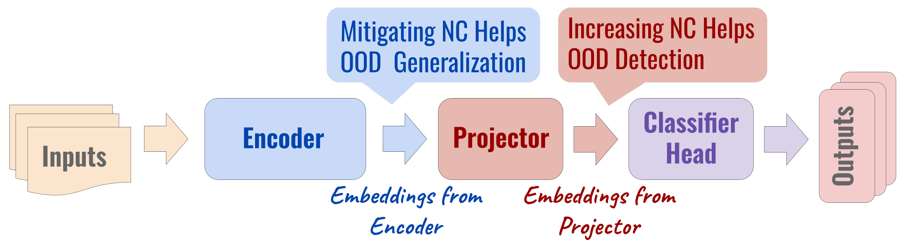
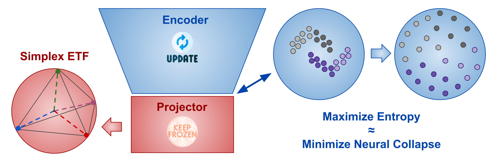

Neural Collapse and OOD Detection/Generalization
================================================
This repository is the official PyTorch implementation of [Controlling Neural Collapse Enhances Out-of-Distribution Detection and Transfer Learning](https://arxiv.org/abs/2502.10691) published at ICML 2025.

Useful links: <br>
[[ArXiv Camera Ready]](https://arxiv.org/abs/2502.10691)<br>
[[Project Page]](https://yousuf907.github.io/ncoodg)<br>





Out-of-distribution (OOD) detection and OOD generalization are widely studied in Deep Neural Networks (DNNs), yet their relationship remains poorly understood. We empirically show that the degree of Neural Collapse (NC) in a network layer is inversely related with these objectives: stronger NC improves OOD detection but degrades generalization, while weaker NC enhances generalization at the cost of detection. This trade-off suggests that a single feature space cannot simultaneously achieve both tasks. To address this, we develop a theoretical framework linking NC to OOD detection and generalization. We show that entropy regularization mitigates NC to improve generalization, while a fixed Simplex Equiangular Tight Frame (ETF) projector enforces NC for better detection. Based on these insights, we propose a method to control NC at different DNN layers. In experiments, our method excels at both tasks across OOD datasets and DNN architectures.


## Dependencies

The conda environment that we used for this project has been shared in the GitHub repository. 
The yml file `environment.yml` includes all the libraries. We have tested the code with the packages and versions specified in the yml file. Our ViT experiments require the timm library, `pip install timm`.
We recommend setting up a `conda` environment using the `environment.yml` file:
```
conda env create -f environment.yml
```


## Repo Structure & Descriptions

* [Neural Collapse Evaluation of VGG/ResNet](./nc_eval): scripts to evaluate Neural Collapse of pretrained VGG and ResNet models
    * [ResNet w/o NC Control](./nc_eval): evaluate NC of baseline ResNet-18 and ResNet-34 models (`nc_eval_resnet.sh`)
    * [ResNet w/ NC Control](./nc_eval): evaluate NC of ResNet-18 and ResNet-34 models which control NC (`nc_eval_resnet_nc.sh`)
    * [VGG w/o NC Control](./nc_eval): evaluate NC of baseline VGG-17 (`nc_eval_vgg.sh`)
    * [VGG w/ NC Control](./nc_eval): evaluate NC of VGG-17 that controls NC (`nc_eval_vgg_nc.sh`)
* [OOD Detection of VGG/ResNet](./ood_det): scripts to evaluate OOD detection performance of pretrained VGG and ResNet models
    * [ResNet w/o NC Control](./ood_det): evaluate OOD detection of baseline ResNet-18 and ResNet-34 models (`ood_det_resnet.sh`)
    * [ResNet w/ NC Control](./ood_det): evaluate OOD detection of ResNet-18 and ResNet-34 models which control NC (`ood_det_resnet_nc.sh`)
    * [VGG w/o NC Control](./ood_det): evaluate OOD detection of baseline VGG-17 (`ood_det_vgg.sh`)
    * [VGG w/ NC Control](./ood_det): evaluate OOD detection of VGG-17 that controls NC (`ood_det_vgg_nc.sh`)
* [OOD Generalization of VGG/ResNet](./ood_gen): scripts to evaluate OOD generalization performance of pretrained VGG and ResNet models using linear probing
    * [ResNet w/o NC Control](./ood_gen): evaluate OOD generalization of baseline ResNet-18 and ResNet-34 models (`train_lp_resnet.sh`)
    * [ResNet w/ NC Control](./ood_gen): evaluate OOD generalization of ResNet-18 and ResNet-34 models which control NC (`train_lp_resnet_nc.sh`)
    * [VGG w/o NC Control](./ood_gen): evaluate OOD generalization of baseline VGG-17 (`train_lp_vgg.sh`)
    * [VGG w/ NC Control](./ood_gen): evaluate OOD generalization of VGG-17 that controls NC (`train_lp_vgg_nc.sh`)
* [Pretraining of ResNet](./resnet): scripts to pretrain ResNet models
    * [ResNet w/o NC Control](./resnet): pretrain baseline ResNet-18 and ResNet-34 models (`pretrain_resnet.sh`)
    * [ResNet w/ NC Control](./resnet): pretrain ResNet-18 and ResNet-34 models which control NC (`pretrain_resnet_nc.sh`)
* [Pretraining of VGG](./vgg): scripts to pretrain VGG models
    * [VGG w/o NC Control](./vgg): pretrain baseline VGG-17 (`pretrain_vgg.sh`)
    * [VGG w/ NC Control](./vgg): pretrain VGG-17 which controls NC (`pretrain_vgg_nc.sh`)
* [Pretraining and OOD Evaluation of ViT](./vit_exp_all): scripts to pretrain and evaluate ViT models
    * [Pretraining of ViT](./vit_exp_all): scripts to pretrain ViT-T and ViT-S models (`pretrain_vit.sh`, `pretrain_vit_nc.sh`)
    * [OOD Detection of ViT](./vit_exp_all): scripts to evaluate OOD detection performance of pretrained ViT-T and ViT-S models (`eval_ood_det.sh`, `eval_ood_det_nc.sh`)
    * [OOD Generalization of ViT](./vit_exp_all): scripts to evaluate OOD generalization performance of pretrained ViT-T and ViT-S models (`train_lp.sh`, `train_lp_nc.sh`)
    * [Neural Collapse Evaluation of ViT](./vit_exp_all): scripts to evaluate Neural Collapse of pretrained ViT-T and ViT-S models (`eval_nc_baseline.sh`, `eval_nc_ours.sh`)


## Citation
If you find our repository helpful, please cite our paper.
```bibtex
@inproceedings{harun2025controlling,
    title     = {Controlling Neural Collapse Enhances Out-of-Distribution Detection and Transfer Learning},
    author    = {Harun, Md Yousuf and Gallardo, Jhair and Kanan, Christopher},
    booktitle = {International Conference on Machine Learning},
    year      = {2025},
    url       = {https://openreview.net/forum?id=8AGdUCdDyI}
}
```